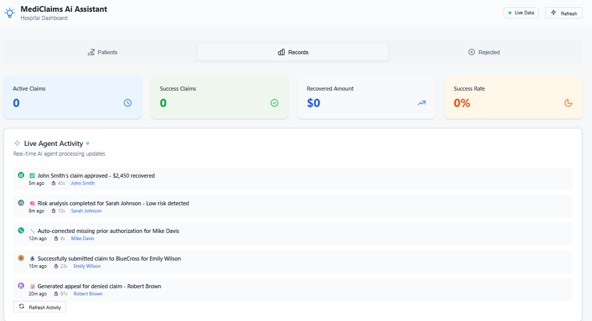
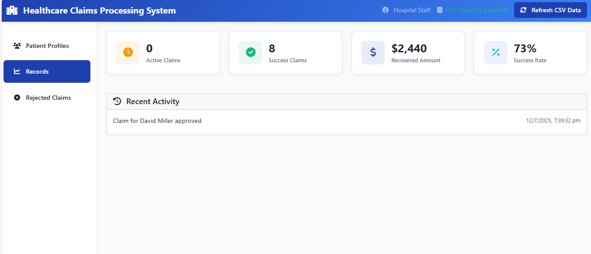
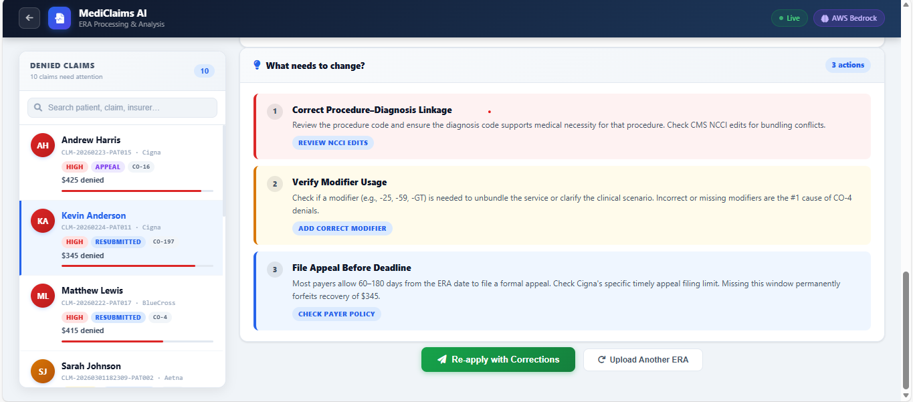
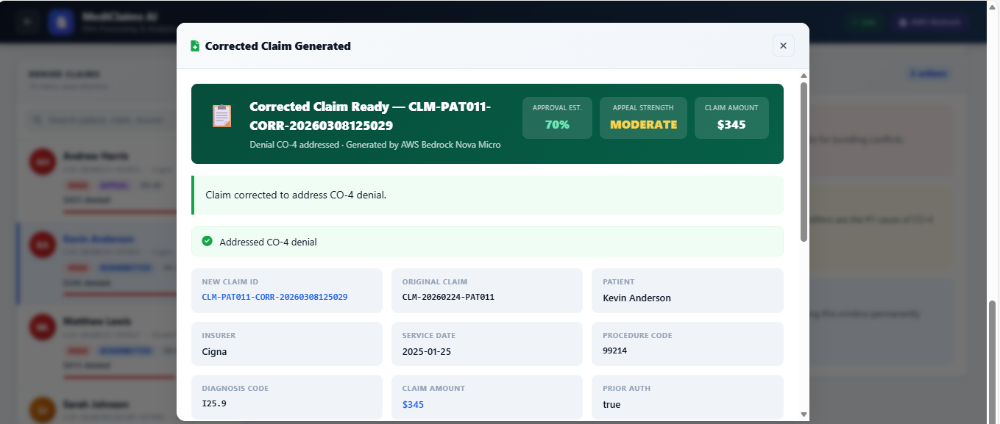
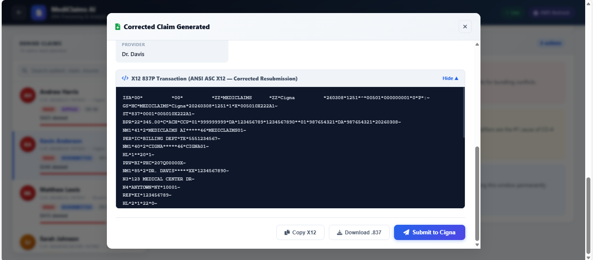

# MediClaims AI

A prototype built for **AI for Bharat Hackathon** under the **Healthcare & Life Sciences** domain.

---


## What It Does

Healthcare providers lose revenue every year due to insurance claim denials caused by missing data, wrong codes, or incomplete documentation. MediClaims AI automates the entire claims lifecycle using six AI agents that work together — from fetching patient data, predicting denials, correcting errors, submitting claims, generating appeals, and learning from outcomes.

---


## The Six AI Agents

| Agent | What It Does |
|-------|-------------|
| Risk Predictor | Scores each claim for denial probability before submission |
| Auto Corrector | Fixes missing fields, validates medical codes, adds prior auth |
| Claim Submitter | Submits claims to insurers in ANSI X12 837P format |
| Appeal Generator | Writes an AI-generated appeal letter based on the denial reason |
| Resubmitter | Resubmits the corrected claim with the appeal attached |
| Feedback Learner | Learns from every outcome to improve future predictions |

---

## AWS Services Used

| Service | Purpose |
|---------|---------|
| **EC2** (t3.medium) | Hosts Flask :5000 (pre-submission), FastAPI :8003 (post-submission), MCP :8001, nginx |
| **Application Load Balancer** | Single public URL, routes traffic to Flask and FastAPI |
| **Bedrock Agent Core** | Six individual AI agents, each with its own ID and action group |
| **Bedrock — Nova Micro** | Foundation model used by all agents (`us.amazon.nova-micro-v1:0`) |
| **Lambda** | Six functions as action groups — implement real tool logic per agent |
| **S3** | Stores patient data, claims, ERA files, appeal PDFs, X12 transactions, logs |
| **IAM** | `MediClaimsEC2Role` and `BedrockAgentsClaimsRole` for secure access |

---

## Live URLs

| | URL |
|-|-----|
|Visit | https://mvp.mediclaimsai.com/ |
---

## Run Locally

### 1. Install Dependencies
```bash
pip install -r requirements.txt
```

### 2. Configure Environment Variables

Create a `.env` file in the project root with the following:

```bash
# === AWS Core ===
AWS_ACCESS_KEY_ID=your_access_key
AWS_SECRET_ACCESS_KEY=your_secret_key
AWS_DEFAULT_REGION=us-east-1
AWS_ACCOUNT_ID=your_account_id

# === Bedrock Model ===
AWS_BEDROCK_MODEL_ID=us.amazon.nova-micro-v1:0

# === S3 Storage ===
S3_BUCKET_NAME=your-bucket-name

# === Bedrock Agent IDs (6 Agents) ===
BEDROCK_AGENT_RISK_PREDICTOR=your_risk_predictor_id
BEDROCK_AGENT_APPEAL_GENERATOR=your_appeal_generator_id
BEDROCK_AGENT_AUTO_CORRECTOR=your_auto_corrector_id
BEDROCK_AGENT_CLAIM_SUBMITTER=your_claim_submitter_id
BEDROCK_AGENT_RESUBMITTER=your_resubmitter_id
BEDROCK_AGENT_FEEDBACK_LEARNER=your_feedback_learner_id

# === Bedrock Agent Aliases (Optional - falls back to TSTALIASID) ===
BEDROCK_AGENT_ALIAS=TSTALIASID
BEDROCK_AGENT_ALIAS_RISK_PREDICTOR=your_alias_id
BEDROCK_AGENT_ALIAS_APPEAL_GENERATOR=your_alias_id
BEDROCK_AGENT_ALIAS_AUTO_CORRECTOR=your_alias_id
BEDROCK_AGENT_ALIAS_CLAIM_SUBMITTER=your_alias_id
BEDROCK_AGENT_ALIAS_RESUBMITTER=your_alias_id
BEDROCK_AGENT_ALIAS_FEEDBACK_LEARNER=your_alias_id

# === IAM Role ===
BEDROCK_AGENTS_ROLE_ARN=arn:aws:iam::your_account_id:role/BedrockAgentsClaimsRole

# === System Configuration ===
OPERATIONAL_MODE=mcp
MCP_SERVER_URL=http://localhost:8001
DATA_SOURCE=openemr
```

### 3. Start Services
```bash
python start_all.py
```

| Service | URL |
|---------|-----|
| Pre-submission dashboard | http://localhost:5000 |
| Post-submission appeals | http://localhost:8003 |

---

## Screenshots

### Pre-Submission Dashboard



### Post-Submission Appeals





*Prototype — AI for Bharat Hackathon 2026*
