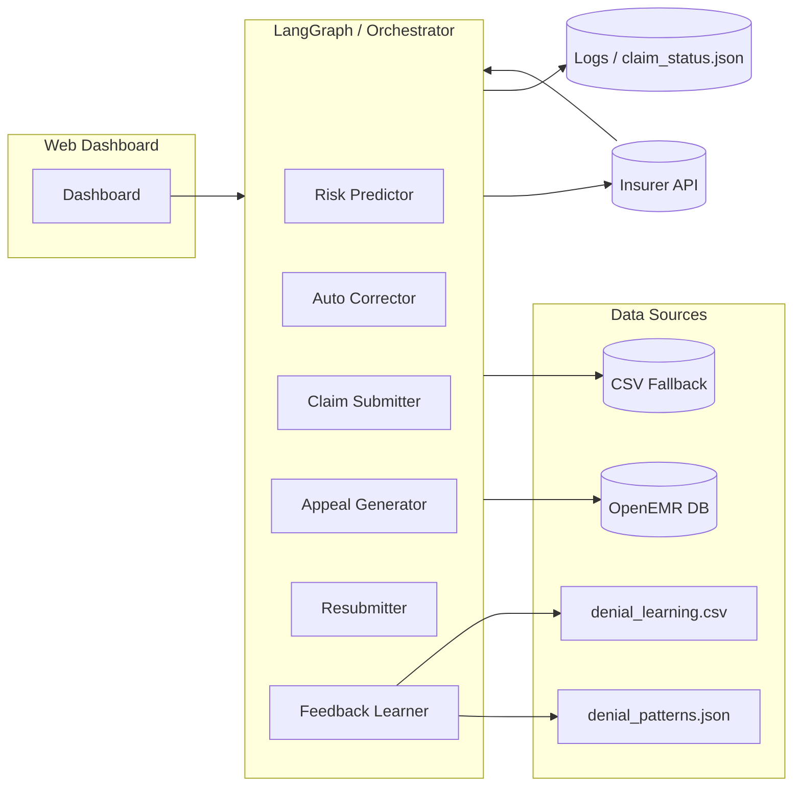
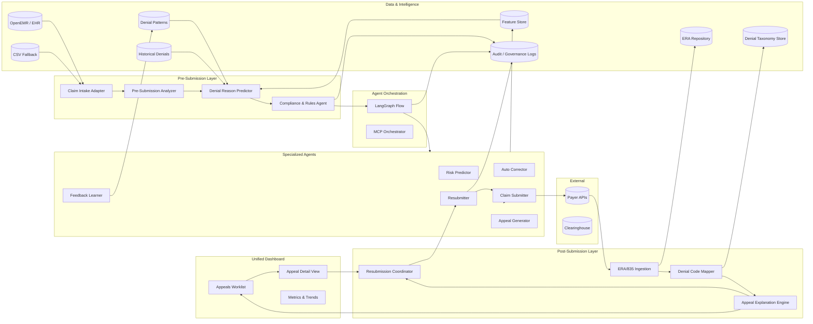
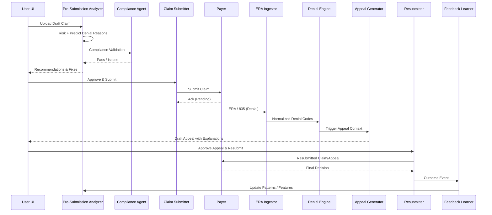

# MediClaims AI – Architecture Evolution (Pre vs New Pre/Post-Denial Flows)

## 1. Purpose
Concise view of the original (current) architecture and the proposed evolved design introducing explicit Pre-Submission (pre‑denial) and Post-Submission (post‑denial) workflows with new compliance, ERA ingestion, denial intelligence, and human‑in‑loop enhancements.

---
## 2. BEFORE (Current POC Architecture)

### 2.1 Core Layers
- Presentation: Web Dashboard (patients, claim status)
- Orchestration: LangGraph `ClaimFlow` + (optional) MCP Orchestrator
- Agents: Risk Predictor → Auto Corrector → Claim Submitter → (Appeal Generator → Resubmitter) → Feedback Learner
- Data Access: Unified (OpenEMR DB → CSV fallback) + MCP tools
- External APIs: Mock Insurer API(s)
- Learning Assets: `denial_learning.csv`, `denial_patterns.json`
- Logging & Status: JSONL logs + `claim_status.json`

### 2.2 Current High-Level Flow
1. Claim ingested (manual / sample) → Risk Predictor
2. Conditional correction → Submission
3. Insurer response (approved / rejected / pending)
4. If rejected → Appeal Generation → Resubmission → Feedback
5. Feedback Learner updates patterns

### 2.3 Current Architecture Diagram


---
## 3. AFTER (Proposed Enhanced Architecture)

### 3.1 Key Additions
| Capability | New Component | Purpose |
|------------|---------------|---------|
| Pre-Submission Denial Prediction | Pre‑Submission Analyzer (Risk + Predictive Denial Reason Engine) | Forecast likely denial reasons before submission |
| Compliance & Rules | Compliance & State Rules Agent | Validate state, payer, HIPAA constraints before submit/appeal |
| ERA / 835 Ingestion | ERA Ingestion Service | Parse payer remits, map denial codes → internal taxonomy |
| Denial Intelligence | Denial Reason Engine (taxonomy + grouping) | Normalize multi-payer codes to friendly categories |
| Appeal Insight Layer | Appeal Detail Service | Explainable reasons + recommended fixes (pre & post) |
| Human-in-the-Loop | Appeals Worklist UI | Pending / Active / Denied / Approved buckets with actions |
| Audit & Governance | Governance Layer (AgentRise integration) | AuthN/Z, action provenance, rationale capture |
| Event Backbone | Internal Event Bus (async queue) | Decouple flows (ERAReceived, AppealSubmitted, PatternUpdated) |
| Learning Store | Feature Store + Model Feedback Loop | Structured features for continuous model retraining |

### 3.2 Target Logical Architecture


### 3.3 Separation of Flows
```mermaid
flowchart TB
    subgraph PreFlow[Pre-Submission Flow]
        A1[Claim Intake] --> A2[Risk & Predictive Denial Analysis]
        A2 --> A3[Compliance & Policy Check]
        A3 --> A4[Recommend Corrections]
        A4 --> A5[Human Review (Optional)]
        A5 --> A6[Submit Claim]
    end
    subgraph PostFlow[Post-Submission Flow]
        B1[ERA / 835 Received] --> B2[Parse & Map Codes]
        B2 --> B3[Categorize Denial Reasons]
        B3 --> B4[Appeal Generation]
        B4 --> B5[Human Review / Edit]
        B5 --> B6[Resubmission]
        B6 --> B7[Outcome + Feedback]
        B7 --> B8[Pattern / Feature Update]
        B8 --> A2
    end
```

### 3.4 Event Model (Indicative)
| Event | Producer | Consumers | Purpose |
|-------|----------|-----------|---------|
| ClaimIntakeReceived | Intake Adapter | Pre-Submission Analyzer | Start pipeline |
| RiskAssessed | Risk Predictor | Denial Predictor, Dashboard | Display & feature enrichment |
| PreSubmissionRecommendationReady | Analyzer | UI, Submitter | Human decision point |
| ClaimSubmitted | Submitter | ERA Watcher, Dashboard | Track lifecycle |
| ERAReceived | ERA Ingestor | Code Mapper, Denial Engine | Start post-denial processing |
| DenialCategorized | Denial Engine | Appeal Generator, Learner | Trigger appeal flow |
| AppealGenerated | Appeal Generator | Worklist UI | Human approval |
| ClaimResubmitted | Resubmitter | Dashboard, Audit | Compliance trace |
| PatternUpdated | Learner | Predictor, Denial Engine | Continuous improvement |

---
## 4. Delta Summary (Before → After)
| Aspect | Before | After |
|--------|--------|-------|
| Denial Handling | Reactive (after rejection) | Predictive + Reactive with ERA ingestion |
| Compliance | Implicit / manual | Explicit Compliance Agent pre + post |
| Denial Intelligence | Simple pattern CSV | Structured taxonomy + mapping engine |
| Appeal UI | Basic status view | Full appeals worklist + detail analytics |
| Learning Loop | Feedback learner on denial patterns | Closed loop via feature store + predictive feedback |
| Observability | Logs + status JSON | Event log + audit + governance records |
| Extensibility | Linear LangGraph | Layered + event-driven + modular services |

---
## 5. Recommended Implementation Phases
1. Foundation: Event schema + ERA ingestion + denial taxonomy
2. Pre-Submission: Predictive denial reason engine + compliance agent
3. Post-Submission: Appeal explanation engine + refined resubmission coordinator
4. Human Loop: Appeals worklist UI + edit & approve
5. Intelligence: Feature store + continuous model tuning
6. Governance: Full audit provenance + AgentRise integration

---
## 6. Data & Storage Additions
- ERA Repository: Raw + normalized remittance files
- Denial Taxonomy Store: Mapping payer codes → canonical categories
- Feature Store: Aggregated engineered features for prediction
- Audit & Governance Ledger: Immutable agent & user actions

---
## 7. Security & Compliance Enhancements
- Pre-Submission compliance gating (state rules, payer policy, HIPAA data checks)
- Redaction pipeline for PHI in logs
- Signed audit events for downstream analytics/governance

---
## 8. Key Interfaces (Future)
| Interface | Protocol | Notes |
|-----------|----------|-------|
| Event Bus | (e.g. NATS / Kafka / Redis Streams) | Decouple pre/post flows |
| ERA Intake API | REST / SFTP watch | 835 file drops → parse events |
| Governance API | REST | Query audit lineage |
| Feature Store | gRPC / REST | Real-time feature retrieval |

---
## 9. Minimal Sequence (Pre vs Post)


---
## 10. Upgrade Strategy (Risk-Controlled)
- Parallel run: Keep legacy linear flow while piloting event-driven additions
- Feature flags: Toggle predictive denial & compliance gating
- Shadow ingestion: Parse ERA files without impacting production decisions first
- Backfill: Populate taxonomy + feature store from historical CSV/Logs

---
## 11. KPIs Enabled
- Pre-Submission Prevented Denials (%)
- Appeal Turnaround Time
- Denial Categorization Accuracy
- Compliance Block Rate vs True Violations
- Resubmission Success Rate (1st attempt)
- Model Drift Indicators (feature stability)

---
## 12. Summary
The evolved architecture formalizes two explicit life-cycle phases (Pre & Post) with predictive, explainable, and compliant automation—transitioning from a linear reactive pipeline to a modular, event-driven, intelligence-amplifying platform ready for scale and governance.

---
## 13. Diagram Export Notes
Use Mermaid CLI or VS Code Mermaid preview for PNG/SVG export. For enterprise presentations, optionally re-draw in draw.io / Lucid with identical component grouping.
